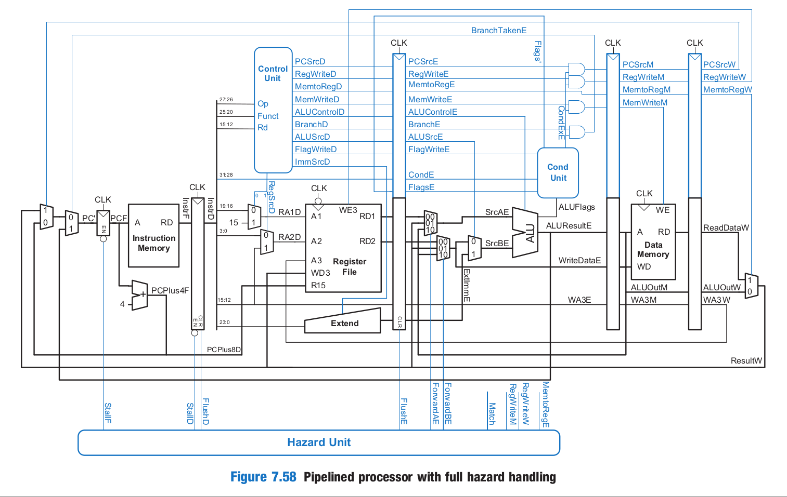
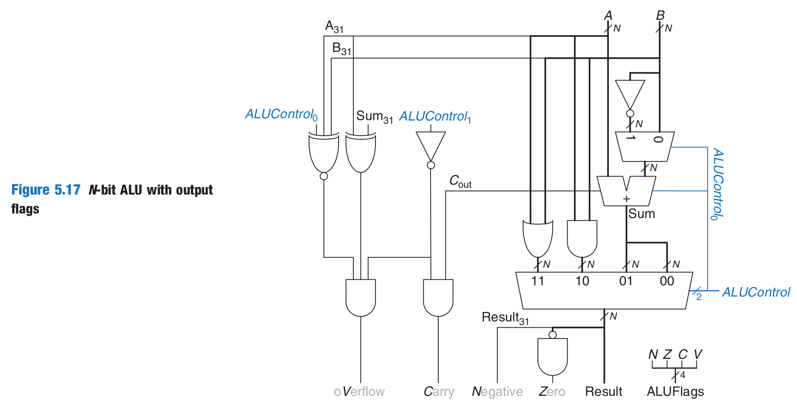
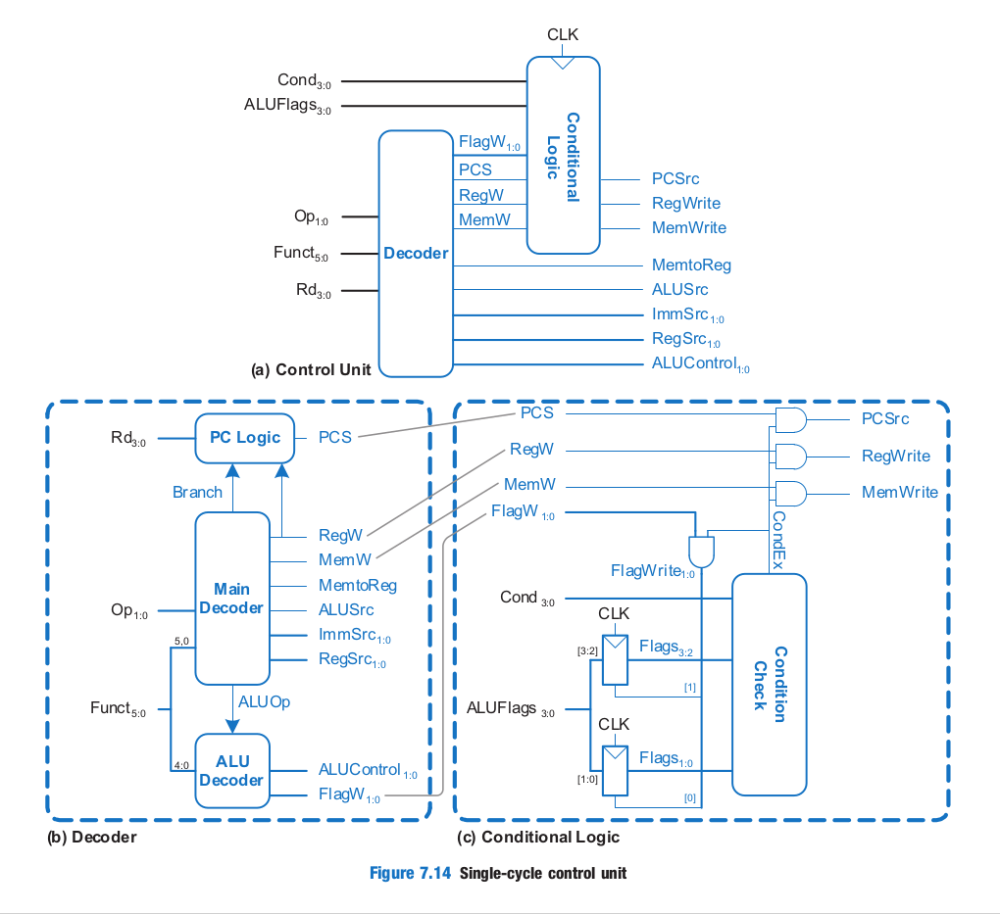
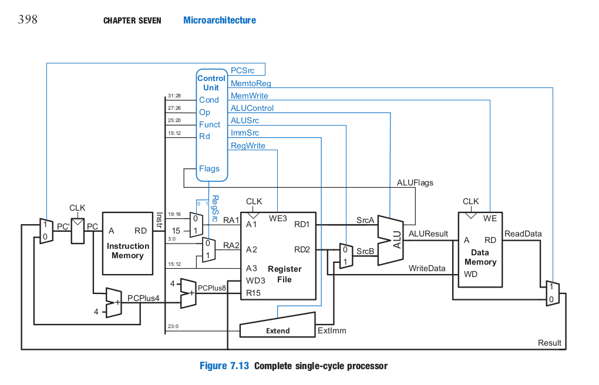
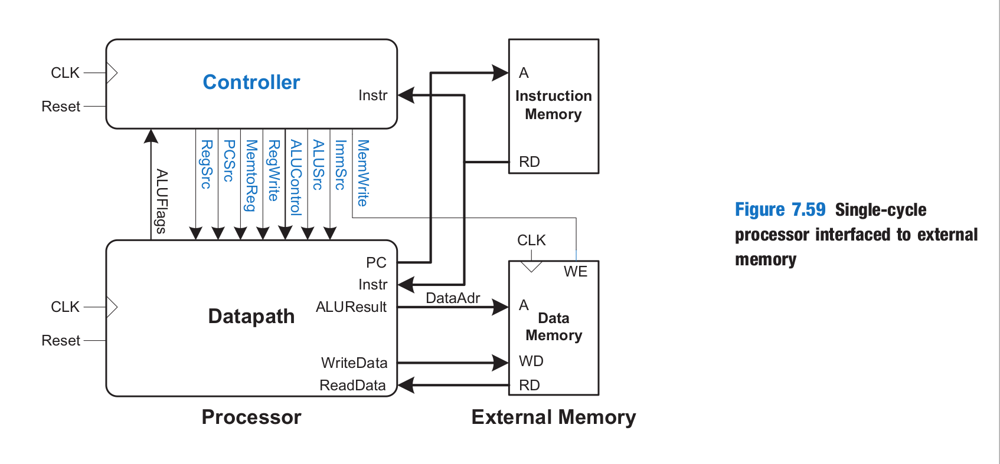

# Pipeline

Este proyecto implementa un pipeline básico en Vivado para procesadores ARM, con un ciclo único que soporta un conjunto inicial de instrucciones.

## Instrucciones Soportadas

El pipeline actual maneja las siguientes instrucciones:

- **Operaciones Aritméticas y Lógicas**:  
  - `ADD` y `SUB` (con operandos de registro e inmediato, sin desplazamientos)
  - `AND` y `ORR` (con operandos de registro e inmediato, sin desplazamientos)

- **Operaciones de Memoria**:
  - `LDR` y `STR` (con desplazamiento inmediato positivo)

- **Instrucciones de Salto**:
  - `B` (salto incondicional)

## Configuración del Proyecto

Para configurar el proyecto en Vivado, sigue estos pasos:

1. **Clonar el repositorio**  
   Abre una terminal y clona el repositorio en tu máquina local:
   ```bash
   git clone git@github.com:JFpro160/pipeline.git
   ```

2. **Abrir el Proyecto en Vivado**  
   - Abre Vivado y selecciona la opción para abrir un proyecto existente.
   - Navega hasta el directorio del proyecto clonado y selecciona el archivo `pipeline.xpr`.

3. **Ejecutar el Diseño**  
   Una vez que el proyecto esté abierto en Vivado, puedes sintetizar, implementar y simular el diseño según sea necesario.

## Instrucciones de Ensamblador ARM

Este proyecto permite cargar instrucciones de ensamblador ARM en formato hexadecimal para probar el pipeline. Puedes generar instrucciones en formato Big Endian en [ARM Converter](https://armconverter.com/).

Las instrucciones predefinidas para el testbench están en el archivo `memfile.asm`, ubicado en la carpeta `pipeline.ip_user_files/mem_init_files/`. Estas instrucciones son las siguientes:

```asm
E04F100F // SUB R1, PC, R15 ; R1 = PC - R15
E2811007 // ADD R1, R1, #7 ; R1 = R1 + 7
E04F200F // SUB R2, PC, R15 ; R2 = PC - R15
E2822064 // ADD R2, R2, #100 ; R2 = R2 + 100
E5821000 // STR R1, [R2] ; Mem[R2] = R1
```

Estas instrucciones están diseñadas para validar el funcionamiento del pipeline en el testbench predeterminado.

**Nota:** Los registros y la memoria comienzan en valores indefinidos (`XXXXXXXXX`). Se recomienda inicializarlos en `0` usando una instrucción como `SUB R0, R15, R15`.

## Testbench

El testbench incluido (`testbench.v`) simula el pipeline y verifica la ejecución correcta de las instrucciones cargadas:

- **Secuencia de Reset**: Se inicia con un `reset` activo durante los primeros 22 nanosegundos para asegurar un inicio limpio.
  
- **Generación de Señal de Reloj**: La señal de reloj (`clk`) se alterna cada 5 nanosegundos, simulando el ciclo de trabajo.

- **Verificación de Escriba en Memoria**:  
  - El testbench monitorea la señal `MemWrite`. Si `MemWrite` está activo y la dirección de memoria (`DataAdr`) es `100` con un valor de escritura (`WriteData`) de `7`, se muestra `"Simulation succeeded"` y se detiene la simulación. Esto indica que las instrucciones se ejecutaron correctamente.
  - Si `MemWrite` se activa en otra dirección distinta de `96`, se muestra `"Simulation failed"` y se detiene la simulación.

- **Configuración de Tiempo Máximo de Simulación**:  
  - La simulación está configurada con un tiempo máximo de `100` unidades. Si se alcanza este límite sin éxito, el testbench muestra `"Simulation timed out"` y finaliza la simulación. Puedes ajustar este límite según sea necesario.

- **Dumpfile y Dumpvars**:  
  - Aunque el proyecto está configurado para Vivado, las directivas `$dumpfile` y `$dumpvars` se incluyeron para que se pueda compilar el testbench con Icarus Verilog y visualizar las señales en GTKWave, si se desea.

Este testbench es la versión predeterminada del código proporcionado en Canvas y sigue el diseño de referencia del libro de Harris & Harris.

## Imágenes del Proyecto

Aquí están las imágenes relacionadas con el pipeline para ayudarte a visualizar el proyecto y su estructura:







Cada imagen ilustra componentes específicos del pipeline, como el datapath, la ALU y el controlador de ciclo único, para una comprensión más visual del diseño del proyecto.

